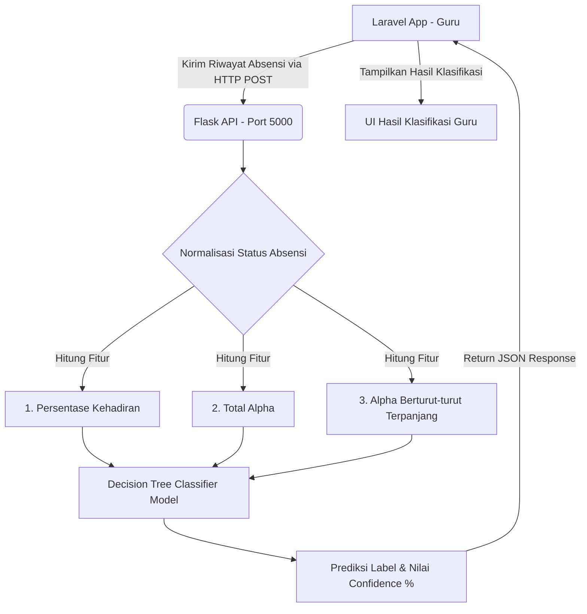

# DisiplinKu - Sistem Absensi & Klasifikasi Kedisiplinan Siswa SMAN 1 PLUTO

**DisiplinKu** adalah platform digital manajemen kehadiran sekolah berbasis web yang dirancang khusus untuk **SMAN 1 PLUTO**. Sistem ini memadukan kemudahan pencatatan absensi secara real-time dengan modul kecerdasan buatan (*Machine Learning*) untuk melakukan klasifikasi kedisiplinan siswa secara otomatis menggunakan algoritma **Decision Tree Classifier**.

---

## 🚀 Fitur Utama

1. **Official School Landing Page**:
   - Tampilan profil SMAN 1 PLUTO yang modern, elegan, dan profesional.
   - Menggunakan kerangka kerja Tailwind CSS yang responsif.
   - Animasi transisi halaman saat digulir menggunakan library **AOS (Animate on Scroll)**.
   
2. **Portal Absensi Guru (Dashboard)**:
   - Manajemen presensi siswa secara harian dan per-kelas.
   - Visualisasi tren kehadiran kelas yang interaktif.
   - Daftar kelas yang ringkas dilengkapi dengan sistem scrollbar vertikal untuk kestabilan layout.

3. **Klasifikasi Kedisiplinan Berbasis AI (Machine Learning)**:
   - Integrasi langsung dengan API Flask Python untuk menganalisis data kehadiran secara berkala.
   - Menggunakan algoritma **Decision Tree Classifier** untuk memetakan kepatuhan siswa ke dalam 4 kategori disiplin:
     - `Sangat Disiplin`
     - `Disiplin`
     - `Kurang Disiplin`
     - `Bermasalah`
   - Fitur inisialisasi model cepat berbasis *Singleton Pattern* untuk efisiensi RAM dan CPU pada sisi server Flask.

4. **Filament Admin Panel**:
   - Panel manajemen data master siswa, guru, kelas, dan absensi yang aman dan siap pakai untuk Administrator.

---

## 🛠️ Arsitektur & Alur AI Klasifikasi



---

## 💻 Spesifikasi Teknologi

- **Backend Utama**: Laravel 13 (PHP ^8.3), Filament v5 (Panel Admin)
- **Frontend & UI**: Tailwind CSS, Alpine.js, AOS Library
- **Database**: MySQL / MariaDB
- **Machine Learning Service**: Python 3.x, Flask, Scikit-Learn, NumPy

---

## ⚙️ Cara Instalasi & Konfigurasi

### 1. Prasyarat Sistem
Pastikan perangkat Anda telah terpasang:
- PHP >= 8.3
- Composer
- Node.js & NPM
- Python 3.8+ & pip
- MySQL Server

### 2. Setup Proyek Laravel
1. Clone repository ini dan masuk ke direktori proyek.
2. Pasang dependensi PHP Composer:
   ```bash
   composer install
   ```
3. Salin file konfigurasi `.env`:
   ```bash
   copy .env.example .env
   ```
4. Buat kunci enkripsi aplikasi:
   ```bash
   php artisan key:generate
   ```
5. Sesuaikan konfigurasi database Anda di dalam berkas `.env`:
   ```env
   DB_CONNECTION=mysql
   DB_HOST=127.0.0.1
   DB_PORT=3306
   DB_DATABASE=nama_database_anda
   DB_USERNAME=root
   DB_PASSWORD=
   ```
6. Jalankan migrasi database beserta seeder data dummy:
   ```bash
   php artisan migrate --seed
   ```

### 3. Setup Aset Frontend (CSS, JS, & AOS)
1. Pasang paket NPM (termasuk library AOS untuk animasi):
   ```bash
   npm install
   ```
2. Jalankan server kompilasi aset Vite:
   ```bash
   npm run dev
   ```

### 4. Setup Layanan Machine Learning (Python Flask)
1. Masuk ke folder microservice Python:
   ```bash
   cd python-ml
   ```
2. Buat lingkungan virtual (*Virtual Environment*) dan aktifkan:
   - **Windows**:
     ```bash
     python -m venv venv
     venv\Scripts\activate
     ```
   - **Linux / MacOS**:
     ```bash
     python -m venv venv
     source venv/bin/activate
     ```
3. Pasang paket python yang dibutuhkan:
   ```bash
   pip install -r requirements.txt
   ```
4. Latih model Decision Tree untuk pertama kali:
   ```bash
   python model.py
   ```

---

## 🚦 Langkah Menjalankan Aplikasi

Pastikan kedua server (Laravel & Flask) berjalan secara bersamaan agar modul AI berfungsi dengan baik.

### Langkah A - Menjalankan Aplikasi Utama (Laravel)
Jalankan perintah ini di root direktori proyek:
```bash
php artisan serve
```
*Aplikasi web dapat diakses melalui browser di alamat [http://127.0.0.1:8000](http://127.0.0.1:8000).*

### Langkah B - Menjalankan Layanan AI (Python Flask)
Aktifkan virtual environment di folder `python-ml`, kemudian jalankan:
```bash
python app.py
```
*Layanan Flask API akan aktif di alamat [http://127.0.0.1:5000](http://127.0.0.1:5000).*

---

## 🔒 Lisensi
Proyek Sistem Absensi DisiplinKu ini dilisensikan di bawah lisensi **MIT**.
